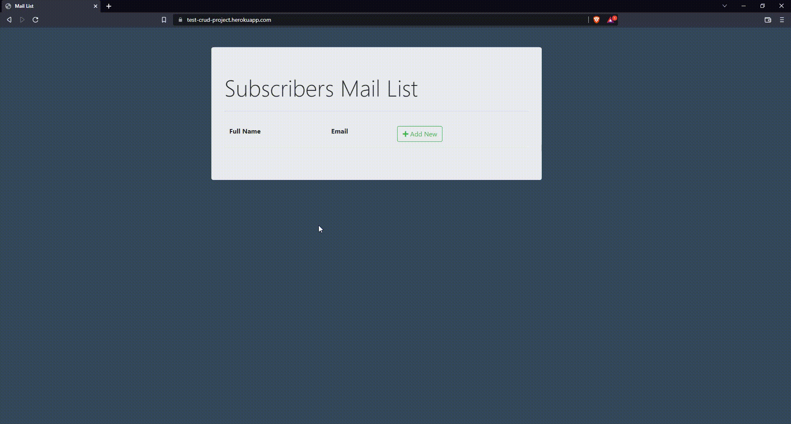

# Campaign-Monitor-API

This project is a simple web app which manages a mail list with the use of the [Campaign Monitor API](https://www.campaignmonitor.com/api/). It allows a user to add or remove subscribers from the list (Create, Delete operations) by directly interacting with the API.

## Created With

- [Bootstrap](https://getbootstrap.com/])
- [Django](https://www.djangoproject.com/)

This is a first attempt of building a web app using the Django framework, as well as consuming an API in general.

**NOTE**: This is a work in progress and contains some bugs that are analyzed further below.

## Usage

Project can be found online at https://test-crud-project.herokuapp.com/. You can also test the project locally by running the following commands:

- Clone this repository.

  ```console
  git clone https://github.com/nevwalkalone/Campaign-Monitor-API.git
  ```

- Change to the project directory

  ```console
  cd Campaign-Monitor-API
  ```

- Create a Virtual Environment

  ```console
  python -m venv <name_of_choice>
  ```

- Activate the Virtual Environment

  ```console
  <name_of_choice>\Scripts\activate
  ```

- Install requirements using pip

  ```console
  pip install -r requirements.txt
  ```
  
 - Add your api key and list_id in `subscribers/views.py`. **This is necessary in order so that the project runs correctly**

- Run the server

  ```console
  python manage.py runserver
  ```

  Project will now be live running on 127.0.0.1:8000.

## Challenges

As mentioned above this was a first on the usage of the Django Framework. I had to watch a lot of tutorials to understand the basics of the framework in order to get the project up and running. I also had to learn a lot of new things about APIs and how to consume them, as the documentation of the Campaign Monitor API was not very clear.

## Known Bugs

The main issue with the current project is that whenever deleting or inserting a subscriber the API call has a considerable delay, meaning that the user has to manually refresh the page to see the changes to the list. I've managed to solve this manually via Python, but I quickly discarded this solution, as the user had to wait up to 8 seconds until the page was fully refreshed with the updated data.

Because this is a work in progress, I will definitely try and fix this problem by also adding Javascript to the project, in order to add async waits, loading screens etc.

## Demo



## Contributions

If you want to contribute, you can always create a pull request or open an issue.
